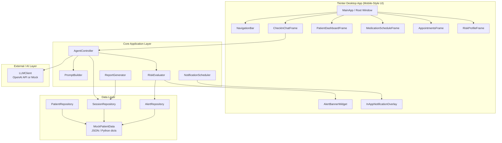
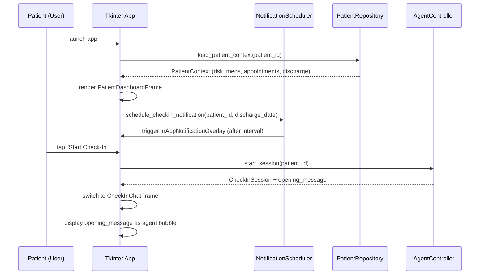
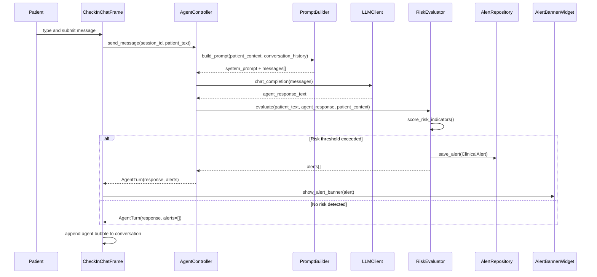
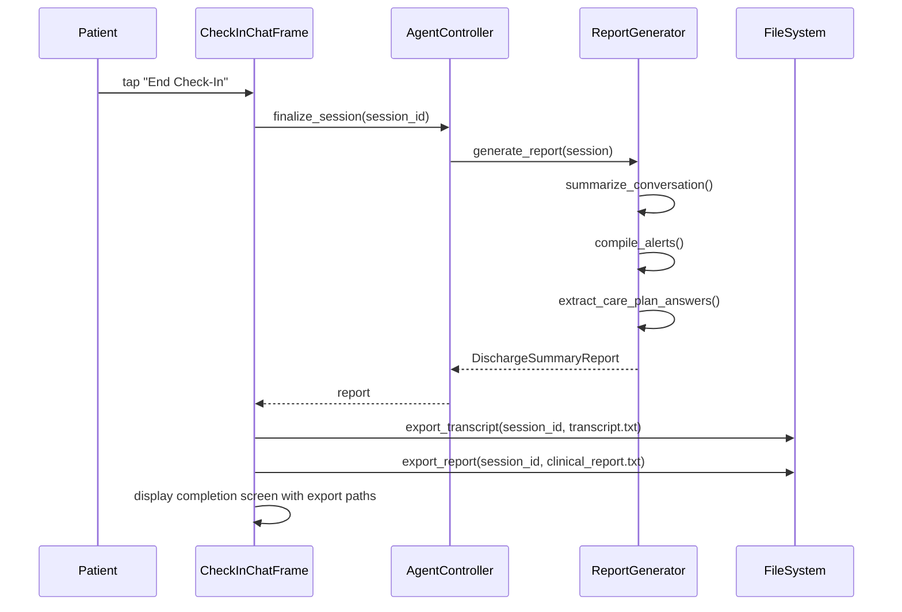

# Design Document: AI Support Check-In Agent

## Overview

The AI Support Check-In Agent is a Python desktop application built with Tkinter that simulates a mobile-style post-discharge patient support interface. It targets elderly patients recovering at home after hospital discharge, proactively engaging them in structured wellbeing conversations through an AI-powered chat agent.

The application displays patient risk profiles, medication schedules, and follow-up appointment details — then conducts LLM-driven check-in conversations that surface clinically relevant signals. When the agent detects risk indicators (pain escalation, medication non-adherence, confusion, distress), it automatically generates clinical alerts. All conversations are exportable as transcripts and summarised into discharge summary reports for care teams.

The system uses OpenAI's API (or a mock LLM for offline demos) with local mock patient data, making it fully self-contained and demo-ready. The Tkinter UI is designed with large fonts, high contrast, and a single-column mobile-style layout to serve elderly patients with limited tech experience.

## Architecture



## Sequence Diagrams

### App Startup & Notification Trigger Flow



### Conversation & Clinical Alert Generation Flow



### Session Finalization & Report Export Flow



## Components and Interfaces

### Component 1: MainApp (Tkinter Root Window)

**Purpose**: Root application controller. Owns the Tkinter root window, manages frame switching (navigation), initialises all services, and wires the UI to the core layer.

**Interface**:
```python
class MainApp(tk.Tk):
    def __init__(self, patient_id: str) -> None: ...
    def show_frame(self, frame_name: str) -> None: ...
    def trigger_checkin_notification(self) -> None: ...
    def on_session_started(self, session: CheckInSession) -> None: ...
    def on_session_complete(self, report: DischargeSummaryReport) -> None: ...
```

**Responsibilities**:
- Bootstrap all repositories, services, and UI frames
- Manage frame stack and navigation transitions
- Respond to notification triggers by surfacing the overlay
- Pass patient context to all child frames at startup

---

### Component 2: CheckInChatFrame

**Purpose**: The primary patient-facing chat interface. Renders a scrollable conversation thread with agent and patient bubbles, an input bar, and a send button. Optimised for elderly users (large fonts, high contrast).

**Interface**:
```python
class CheckInChatFrame(tk.Frame):
    def __init__(self, parent: tk.Widget, agent: AgentController,
                 patient: PatientContext) -> None: ...
    def append_message(self, role: str, text: str) -> None: ...
    def show_typing_indicator(self) -> None: ...
    def hide_typing_indicator(self) -> None: ...
    def on_send(self) -> None: ...
    def show_alert_banner(self, alert: ClinicalAlert) -> None: ...
    def end_session(self) -> None: ...
```

**Responsibilities**:
- Render scrollable chat bubbles (agent = left/blue, patient = right/grey)
- Run agent API calls on background thread to keep UI responsive
- Display inline alert banners when risk signals are detected
- Show a "Check-In Complete" summary on session finalisation
- Export transcript and report to disk

---

### Component 3: PatientDashboardFrame

**Purpose**: Landing screen displaying patient identity, risk badge, upcoming appointments, and a prompt to start check-in.

**Interface**:
```python
class PatientDashboardFrame(tk.Frame):
    def __init__(self, parent: tk.Widget, patient: PatientContext) -> None: ...
    def render_risk_badge(self, risk_level: str) -> None: ...
    def render_appointments(self, appointments: list[Appointment]) -> None: ...
    def render_next_checkin(self, next_checkin_dt: datetime) -> None: ...
```

**Responsibilities**:
- Display patient name, age, primary diagnosis, and risk level badge
- Show next scheduled check-in date/time
- List upcoming follow-up appointments with description and what-to-expect text
- Navigation entry point to chat, medications, and risk profile screens

---

### Component 4: MedicationScheduleFrame

**Purpose**: Displays the patient's current medications with dosage, schedule, and adherence reminders.

**Interface**:
```python
class MedicationScheduleFrame(tk.Frame):
    def __init__(self, parent: tk.Widget, medications: list[Medication]) -> None: ...
    def render_medication_card(self, med: Medication) -> None: ...
    def mark_taken(self, medication_id: str) -> None: ...
```

**Responsibilities**:
- Render one card per medication with name, dose, frequency, and time-of-day
- Allow patient to mark doses as taken (local state tracking)
- Highlight overdue medications in amber/red

---

### Component 5: RiskProfileFrame

**Purpose**: Clinical risk profile display for the patient. Primarily informational — shows risk factors that inform the agent's conversation strategy.

**Interface**:
```python
class RiskProfileFrame(tk.Frame):
    def __init__(self, parent: tk.Widget, risk_profile: RiskProfile) -> None: ...
    def render_risk_factors(self, factors: list[RiskFactor]) -> None: ...
    def render_risk_score(self, score: int, level: str) -> None: ...
```

**Responsibilities**:
- Display overall risk score and level (Low / Medium / High / Critical)
- List individual risk factors (age, comorbidities, social isolation, prior readmissions)
- Show last-updated timestamp for the profile

---

### Component 6: AgentController

**Purpose**: Core orchestration layer. Manages check-in sessions, builds prompts from patient context, invokes the LLM client, and routes risk evaluation results.

**Interface**:
```python
class AgentController:
    def __init__(self, llm: LLMClient, patient_repo: PatientRepository,
                 session_repo: SessionRepository, risk_evaluator: RiskEvaluator) -> None: ...
    def start_session(self, patient_id: str) -> CheckInSession: ...
    def send_message(self, session_id: str, patient_text: str) -> AgentTurn: ...
    def finalize_session(self, session_id: str) -> DischargeSummaryReport: ...
```

**Responsibilities**:
- Construct check-in sessions with full patient context baked into the system prompt
- Maintain conversation history (list of message dicts) across turns
- Delegate risk evaluation to `RiskEvaluator` after each agent response
- Delegate report generation to `ReportGenerator` on session close

---

### Component 7: LLMClient

**Purpose**: Abstraction layer over the AI provider. Supports both a live OpenAI backend and a fully scripted mock for offline demos.

**Interface**:
```python
class LLMClient(Protocol):
    def chat_completion(self, messages: list[dict],
                        temperature: float = 0.7) -> str: ...

class OpenAIClient:
    def __init__(self, api_key: str, model: str = "gpt-4o") -> None: ...
    def chat_completion(self, messages: list[dict],
                        temperature: float = 0.7) -> str: ...

class MockLLMClient:
    def __init__(self, script: list[str]) -> None: ...
    def chat_completion(self, messages: list[dict],
                        temperature: float = 0.7) -> str: ...
```

**Responsibilities**:
- `OpenAIClient`: format messages for OpenAI Chat Completions API and return response text
- `MockLLMClient`: step through a pre-scripted response list for deterministic demos
- Both implementations satisfy the same `LLMClient` protocol, making them interchangeable

---

### Component 8: RiskEvaluator

**Purpose**: Analyses each conversation turn for clinical risk signals using keyword matching and LLM-assisted severity scoring.

**Interface**:
```python
class RiskEvaluator:
    def __init__(self, patient_context: PatientContext) -> None: ...
    def evaluate(self, patient_text: str, agent_response: str,
                 history: list[dict]) -> list[RiskIndicator]: ...
    def score_severity(self, indicators: list[RiskIndicator]) -> AlertSeverity: ...
    def to_clinical_alert(self, indicators: list[RiskIndicator],
                           session_id: str) -> ClinicalAlert | None: ...
```

**Responsibilities**:
- Apply keyword/regex rules for high-priority signals (chest pain, fall, can't breathe, suicidal ideation)
- Apply semantic scoring rules for moderate signals (medication skipped, pain > 7, confusion)
- Combine risk factor weights from the patient's baseline risk profile
- Return a `ClinicalAlert` only when severity threshold is crossed

---

### Component 9: NotificationScheduler

**Purpose**: Simulates mobile push notifications within the Tkinter app using in-app overlays triggered on a timer.

**Interface**:
```python
class NotificationScheduler:
    def __init__(self, app: MainApp) -> None: ...
    def schedule_checkin(self, patient_id: str,
                          discharge_date: datetime,
                          interval_days: int = 7) -> None: ...
    def schedule_medication_reminder(self, medication: Medication) -> None: ...
    def trigger_now(self, notification_type: str, payload: dict) -> None: ...
    def cancel_all(self, patient_id: str) -> None: ...
```

**Responsibilities**:
- Use `app.after()` (Tkinter's safe timer) to schedule in-app notification overlays
- Simulate weekly check-in reminders from the discharge date
- Trigger medication reminders at scheduled dose times
- Display `InAppNotificationOverlay` with deep-link action to the relevant screen

---

### Component 10: ReportGenerator

**Purpose**: Converts a completed `CheckInSession` into a structured `DischargeSummaryReport` and a plain-text transcript file.

**Interface**:
```python
class ReportGenerator:
    def generate_report(self, session: CheckInSession,
                         patient: PatientContext) -> DischargeSummaryReport: ...
    def export_transcript(self, session: CheckInSession,
                           output_path: str) -> str: ...
    def export_clinical_report(self, report: DischargeSummaryReport,
                                output_path: str) -> str: ...
```

**Responsibilities**:
- Extract care-plan answers from conversation turns (pain level, adherence, mood, mobility)
- Compile all `ClinicalAlert` objects raised during the session
- Write a timestamped plain-text transcript (`transcript_<session_id>.txt`)
- Write a structured clinical report (`clinical_report_<session_id>.txt`)

## Data Models

### Model 1: PatientContext

```python
@dataclass
class PatientContext:
    patient_id: str                     # Unique patient identifier
    name: str                           # Full name
    age: int                            # Age in years (≥ 0)
    primary_diagnosis: str              # Primary discharge diagnosis
    discharge_date: datetime            # Hospital discharge timestamp
    risk_profile: RiskProfile           # Computed risk profile
    medications: list[Medication]       # Current medication schedule
    appointments: list[Appointment]     # Upcoming follow-up appointments
    discharge_notes: str                # Free-text discharge summary notes
    language: str = "en"                # ISO 639-1 language code (default English)
    device_token: str | None = None     # In-app notification identifier
```

**Validation Rules**:
- `age` must be ≥ 0 and ≤ 130
- `discharge_date` must not be in the future
- `medications` list may be empty but must not be None
- `language` must be a valid ISO 639-1 code

---

### Model 2: RiskProfile

```python
@dataclass
class RiskProfile:
    risk_score: int                     # Composite score 0–100
    risk_level: str                     # "LOW" | "MEDIUM" | "HIGH" | "CRITICAL"
    factors: list[RiskFactor]           # Individual contributing factors
    last_updated: datetime              # When the profile was last computed

@dataclass
class RiskFactor:
    name: str                           # e.g. "Age > 75", "Prior readmission"
    weight: float                       # 0.0–1.0 contribution weight
    category: str                       # "demographic" | "clinical" | "social"
```

**Validation Rules**:
- `risk_score` must be in range [0, 100]
- `risk_level` must be one of the four defined strings
- `weight` per factor must be in [0.0, 1.0]

---

### Model 3: Medication

```python
@dataclass
class Medication:
    medication_id: str
    name: str                           # Drug name
    dose: str                           # e.g. "10mg"
    frequency: str                      # e.g. "twice daily"
    times: list[str]                    # e.g. ["08:00", "20:00"]
    instructions: str                   # e.g. "Take with food"
    refill_date: datetime | None        # Next refill date if applicable
    taken_today: bool = False           # Local adherence tracking state
```

---

### Model 4: Appointment

```python
@dataclass
class Appointment:
    appointment_id: str
    description: str                    # e.g. "Cardiology Follow-Up"
    provider_name: str                  # Clinician or department name
    scheduled_dt: datetime              # Date and time of appointment
    location: str                       # Clinic address or "Telehealth"
    what_to_expect: str                 # Plain-language prep instructions
    reminder_sent: bool = False
```

---

### Model 5: CheckInSession

```python
@dataclass
class CheckInSession:
    session_id: str                     # UUID
    patient_id: str
    started_at: datetime
    ended_at: datetime | None
    status: str                         # "ACTIVE" | "COMPLETE" | "ABANDONED"
    messages: list[ConversationMessage] # Ordered conversation history
    alerts: list[ClinicalAlert]         # Alerts raised during session
    care_plan_answers: dict[str, str]   # Extracted structured answers
```

---

### Model 6: ConversationMessage

```python
@dataclass
class ConversationMessage:
    message_id: str
    role: str                           # "system" | "agent" | "patient"
    text: str
    timestamp: datetime
    risk_indicators: list[RiskIndicator] = field(default_factory=list)
```

---

### Model 7: ClinicalAlert

```python
@dataclass
class ClinicalAlert:
    alert_id: str                       # UUID
    session_id: str
    patient_id: str
    alert_type: str                     # "MEDICATION_MISSED" | "PAIN_ESCALATION" |
                                        # "FALL_RISK" | "MENTAL_HEALTH" |
                                        # "EMERGENCY" | "GENERAL_CONCERN"
    severity: str                       # "LOW" | "MEDIUM" | "HIGH" | "CRITICAL"
    description: str                    # Human-readable alert description
    evidence: str                       # Verbatim patient quote(s) that triggered it
    triggered_at: datetime
    acknowledged: bool = False
    acknowledged_by: str | None = None
```

---

### Model 8: AgentTurn

```python
@dataclass
class AgentTurn:
    session_id: str
    patient_message: ConversationMessage
    agent_message: ConversationMessage
    alerts: list[ClinicalAlert]         # Alerts generated this turn
    session_status: str                 # "ACTIVE" | "COMPLETE"
```

---

### Model 9: DischargeSummaryReport

```python
@dataclass
class DischargeSummaryReport:
    report_id: str
    session_id: str
    patient_id: str
    generated_at: datetime
    care_plan_answers: dict[str, str]   # Structured answers from conversation
    alerts_summary: list[ClinicalAlert]
    conversation_summary: str           # LLM-generated plain-English summary
    overall_wellbeing_score: int        # 1–10 computed from conversation signals
    recommended_actions: list[str]      # e.g. ["Escalate to GP re: pain"]
    transcript_path: str                # Path to exported transcript file
```

---

### Model 10: RiskIndicator

```python
@dataclass
class RiskIndicator:
    indicator_type: str                 # e.g. "CHEST_PAIN", "MEDICATION_SKIPPED"
    matched_text: str                   # The text snippet that triggered detection
    confidence: float                   # 0.0–1.0
    severity_contribution: str          # "LOW" | "MEDIUM" | "HIGH" | "CRITICAL"
```

## Algorithmic Pseudocode

### Algorithm 1: AgentController.send_message()

```pascal
ALGORITHM send_message(session_id, patient_text)
INPUT:  session_id: string (UUID of active session)
        patient_text: string (raw patient input)
OUTPUT: AgentTurn containing agent response and any generated alerts

PRECONDITIONS:
  - session_id refers to an existing ACTIVE session
  - patient_text is non-empty string
  - LLMClient is initialised and reachable

POSTCONDITIONS:
  - Conversation history extended with patient_message and agent_message
  - All risk indicators evaluated; alerts persisted if severity threshold crossed
  - Returned AgentTurn reflects accurate session status

BEGIN
  // 1. Load session and patient context
  session ← session_repo.get(session_id)
  ASSERT session.status = "ACTIVE"
  patient ← patient_repo.get(session.patient_id)

  // 2. Build patient message record
  patient_msg ← ConversationMessage(
    role="patient",
    text=patient_text,
    timestamp=now()
  )
  session.messages.append(patient_msg)

  // 3. Build LLM messages list (system prompt + full history)
  messages ← prompt_builder.build(patient, session.messages)

  // 4. Invoke LLM (may be live or mock)
  agent_text ← llm_client.chat_completion(messages, temperature=0.7)

  // 5. Build agent message record
  agent_msg ← ConversationMessage(
    role="agent",
    text=agent_text,
    timestamp=now()
  )
  session.messages.append(agent_msg)

  // 6. Risk evaluation
  indicators ← risk_evaluator.evaluate(patient_text, agent_text, session.messages)
  alerts ← []

  IF indicators IS NOT EMPTY THEN
    alert ← risk_evaluator.to_clinical_alert(indicators, session_id)
    IF alert IS NOT NULL THEN
      alert_repo.save(alert)
      session.alerts.append(alert)
      alerts.append(alert)
    END IF
  END IF

  // 7. Check if session should auto-complete (agent signals completion)
  IF agent_text CONTAINS completion_signal(patient) THEN
    session.status ← "COMPLETE"
    session.ended_at ← now()
  END IF

  // 8. Persist updated session
  session_repo.save(session)

  // 9. Return turn result
  RETURN AgentTurn(
    session_id=session_id,
    patient_message=patient_msg,
    agent_message=agent_msg,
    alerts=alerts,
    session_status=session.status
  )
END
```

**Loop Invariants**: N/A (no loops in main path)

---

### Algorithm 2: RiskEvaluator.evaluate()

```pascal
ALGORITHM evaluate(patient_text, agent_response, history)
INPUT:  patient_text: string
        agent_response: string
        history: list[ConversationMessage]
OUTPUT: list[RiskIndicator]

PRECONDITIONS:
  - patient_text and agent_response are non-empty strings
  - RISK_RULES is a non-empty ordered list of (pattern, indicator_type, severity, confidence)

POSTCONDITIONS:
  - Returns all matched RiskIndicator objects
  - No mutations to input parameters
  - Result list may be empty if no rules match

BEGIN
  indicators ← []
  combined_text ← lowercase(patient_text + " " + agent_response)

  // Pass 1: Emergency keyword rules (highest priority, short-circuit on CRITICAL)
  FOR each rule IN EMERGENCY_RULES DO
    // LOOP INVARIANT: all previously processed rules were evaluated correctly
    IF rule.pattern MATCHES combined_text THEN
      indicators.append(RiskIndicator(
        indicator_type=rule.type,
        matched_text=extract_match(combined_text, rule.pattern),
        confidence=rule.confidence,
        severity_contribution="CRITICAL"
      ))
      RETURN indicators  // Early exit — emergency detected
    END IF
  END FOR

  // Pass 2: Standard risk rules
  FOR each rule IN STANDARD_RULES DO
    // LOOP INVARIANT: all previously processed rules were evaluated correctly
    IF rule.pattern MATCHES combined_text THEN
      indicators.append(RiskIndicator(
        indicator_type=rule.type,
        matched_text=extract_match(combined_text, rule.pattern),
        confidence=rule.confidence,
        severity_contribution=rule.severity
      ))
    END IF
  END FOR

  // Pass 3: Context-aware baseline risk amplification
  IF patient_context.risk_level IN ["HIGH", "CRITICAL"] THEN
    FOR each indicator IN indicators DO
      // LOOP INVARIANT: previously amplified indicators remain correctly scored
      indicator.confidence ← min(1.0, indicator.confidence * 1.25)
    END FOR
  END IF

  RETURN indicators
END
```

---

### Algorithm 3: PromptBuilder.build()

```pascal
ALGORITHM build(patient, conversation_history)
INPUT:  patient: PatientContext
        conversation_history: list[ConversationMessage]
OUTPUT: list[dict] formatted for LLM Chat Completions API

PRECONDITIONS:
  - patient is fully populated PatientContext
  - conversation_history contains at least the opening system message

POSTCONDITIONS:
  - Returns messages list with system prompt first, then alternating agent/patient turns
  - No patient PII is included beyond what is clinically necessary
  - Total token estimate stays within model context window (≤ 8000 tokens)

BEGIN
  // 1. Build system prompt with patient context
  system_content ← format_system_prompt(
    name=patient.name,
    age=patient.age,
    diagnosis=patient.primary_diagnosis,
    risk_level=patient.risk_profile.risk_level,
    discharge_date=patient.discharge_date,
    discharge_notes=patient.discharge_notes,
    medications=patient.medications,
    appointments=patient.appointments
  )

  messages ← [{"role": "system", "content": system_content}]

  // 2. Append conversation history (skip system messages from history)
  FOR each msg IN conversation_history DO
    // LOOP INVARIANT: messages list remains in correct role-alternation order
    IF msg.role IN ["agent", "patient"] THEN
      llm_role ← "assistant" IF msg.role = "agent" ELSE "user"
      messages.append({"role": llm_role, "content": msg.text})
    END IF
  END FOR

  // 3. Enforce token budget (trim oldest non-system messages if over limit)
  WHILE estimate_tokens(messages) > MAX_TOKENS DO
    // Remove the second element (oldest non-system message)
    messages.remove_at(1)
  END WHILE
  // LOOP INVARIANT: system message always remains at index 0

  RETURN messages
END
```

---

### Algorithm 4: ReportGenerator.generate_report()

```pascal
ALGORITHM generate_report(session, patient)
INPUT:  session: CheckInSession (status = "COMPLETE")
        patient: PatientContext
OUTPUT: DischargeSummaryReport

PRECONDITIONS:
  - session.status = "COMPLETE"
  - session.messages is non-empty

POSTCONDITIONS:
  - Report contains non-empty conversation_summary
  - overall_wellbeing_score is in range [1, 10]
  - All alerts from session are included in alerts_summary
  - recommended_actions is non-empty if any HIGH/CRITICAL alerts exist

BEGIN
  // 1. Extract structured care-plan answers
  care_plan_answers ← {}
  FOR each msg IN session.messages WHERE msg.role = "patient" DO
    // LOOP INVARIANT: all previously processed patient messages have been evaluated
    FOR each question IN CARE_PLAN_QUESTIONS DO
      IF question.matches(msg.text) THEN
        care_plan_answers[question.key] ← extract_answer(msg.text, question)
      END IF
    END FOR
  END FOR

  // 2. Compute overall wellbeing score (1–10)
  score ← 7  // default neutral score
  IF "pain" IN care_plan_answers THEN
    pain_val ← parse_int(care_plan_answers["pain"])
    score ← score - floor(pain_val / 3)
  END IF
  IF session.alerts IS NOT EMPTY THEN
    critical_count ← count(a FOR a IN session.alerts WHERE a.severity = "CRITICAL")
    score ← max(1, score - critical_count * 2)
  END IF
  score ← clamp(score, 1, 10)

  // 3. Generate plain-English summary via LLM
  summary ← llm_client.chat_completion(
    build_summary_prompt(session, patient), temperature=0.3
  )

  // 4. Build recommended actions from alerts
  actions ← []
  FOR each alert IN session.alerts DO
    // LOOP INVARIANT: previously processed alerts have their actions included
    IF alert.severity IN ["HIGH", "CRITICAL"] THEN
      actions.append(ALERT_ACTION_MAP[alert.alert_type])
    END IF
  END FOR

  RETURN DischargeSummaryReport(
    session_id=session.session_id,
    patient_id=session.patient_id,
    generated_at=now(),
    care_plan_answers=care_plan_answers,
    alerts_summary=session.alerts,
    conversation_summary=summary,
    overall_wellbeing_score=score,
    recommended_actions=deduplicate(actions)
  )
END
```

## Key Functions with Formal Specifications

### Function 1: `AgentController.start_session()`

```python
def start_session(self, patient_id: str) -> CheckInSession:
```

**Preconditions:**
- `patient_id` is a non-empty string matching an existing patient record
- No `ACTIVE` session already exists for `patient_id`
- `PatientRepository` can load the patient context

**Postconditions:**
- Returns a `CheckInSession` with `status = "ACTIVE"`
- Session contains exactly one `ConversationMessage` with `role = "agent"` (the opening greeting)
- Session is persisted in `SessionRepository`
- `session.patient_id == patient_id`

**Loop Invariants:** N/A

---

### Function 2: `RiskEvaluator.to_clinical_alert()`

```python
def to_clinical_alert(self, indicators: list[RiskIndicator],
                       session_id: str) -> ClinicalAlert | None:
```

**Preconditions:**
- `indicators` is a list (may be empty)
- `session_id` refers to an active session

**Postconditions:**
- Returns `None` if `indicators` is empty or maximum severity is `"LOW"`
- Returns a `ClinicalAlert` with severity equal to the highest severity across all indicators
- `alert.evidence` contains the concatenated `matched_text` from all indicators
- `alert.alert_type` reflects the highest-severity indicator's type

**Loop Invariants:** N/A

---

### Function 3: `LLMClient.chat_completion()` (both OpenAI and Mock)

```python
def chat_completion(self, messages: list[dict],
                    temperature: float = 0.7) -> str:
```

**Preconditions:**
- `messages` is non-empty
- `messages[0]["role"] == "system"`
- `temperature` is in range [0.0, 2.0]
- For `OpenAIClient`: valid API key is configured
- For `MockLLMClient`: internal script list is non-empty

**Postconditions:**
- Returns a non-empty string (the agent's response text)
- Does not mutate the `messages` list
- For `MockLLMClient`: advances internal script index by 1 (cycles when exhausted)

**Loop Invariants:** N/A

---

### Function 4: `NotificationScheduler.schedule_checkin()`

```python
def schedule_checkin(self, patient_id: str,
                      discharge_date: datetime,
                      interval_days: int = 7) -> None:
```

**Preconditions:**
- `patient_id` is a non-empty string
- `discharge_date` is a valid past or present `datetime`
- `interval_days` is a positive integer (> 0)

**Postconditions:**
- A Tkinter `after()` timer is registered for the first notification
- Subsequent notifications are chained via recursive `after()` calls
- No duplicate timers exist for the same `patient_id`

**Loop Invariants:** N/A (timer chain uses recursion, not iteration)

---

### Function 5: `ReportGenerator.export_transcript()`

```python
def export_transcript(self, session: CheckInSession,
                       output_path: str) -> str:
```

**Preconditions:**
- `session` has `status = "COMPLETE"` or `"ABANDONED"`
- `session.messages` is non-empty
- `output_path` is a writable filesystem path

**Postconditions:**
- File at `output_path` is created/overwritten with UTF-8 encoded transcript
- Each message is formatted as `[HH:MM:SS] ROLE: text\n`
- Returns the absolute path of the written file
- File includes header with patient name, session ID, and date

**Loop Invariants:** For the message iteration: all previously written messages appear in correct chronological order in the file.

## Example Usage

```python
# ── Bootstrap the application ───────────────────────────────────────────────
from data.mock_patients import DEMO_PATIENT
from core.llm_client import MockLLMClient, DEMO_SCRIPT
from core.agent_controller import AgentController
from core.risk_evaluator import RiskEvaluator
from data.repositories import PatientRepository, SessionRepository, AlertRepository
from core.report_generator import ReportGenerator
from ui.main_app import MainApp

# Use mock LLM for offline demo
llm = MockLLMClient(script=DEMO_SCRIPT)

# Wire up repositories (in-memory for demo)
patient_repo = PatientRepository(patients=[DEMO_PATIENT])
session_repo = SessionRepository()
alert_repo = AlertRepository()

# Build core controller
risk_eval = RiskEvaluator(patient_context=DEMO_PATIENT)
agent = AgentController(
    llm=llm,
    patient_repo=patient_repo,
    session_repo=session_repo,
    risk_evaluator=risk_eval
)

# Launch Tkinter app
app = MainApp(patient_id="PATIENT_001", agent=agent)
app.mainloop()
```

```python
# ── Example: Programmatic conversation loop (headless / testing) ─────────────
session = agent.start_session("PATIENT_001")
print(f"Agent: {session.messages[-1].text}")

patient_inputs = [
    "I'm feeling okay, a bit tired",
    "My pain is about a 6 out of 10",
    "I haven't taken my metformin today, I forgot",
    "I've been feeling a bit confused in the mornings",
]

for user_input in patient_inputs:
    turn = agent.send_message(session.session_id, user_input)
    print(f"Patient: {user_input}")
    print(f"Agent: {turn.agent_message.text}")
    if turn.alerts:
        for alert in turn.alerts:
            print(f"⚠ ALERT [{alert.severity}]: {alert.description}")

# Finalize and export
report_gen = ReportGenerator(llm=llm)
report = agent.finalize_session(session.session_id)
transcript_path = report_gen.export_transcript(session, "transcript_demo.txt")
clinical_path = report_gen.export_clinical_report(report, "clinical_report_demo.txt")
print(f"Wellbeing score: {report.overall_wellbeing_score}/10")
print(f"Transcript saved to: {transcript_path}")
print(f"Clinical report saved to: {clinical_path}")
```

```python
# ── Example: Mock patient data structure ─────────────────────────────────────
from datetime import datetime, timedelta
from data.models import PatientContext, RiskProfile, RiskFactor, Medication, Appointment

DEMO_PATIENT = PatientContext(
    patient_id="PATIENT_001",
    name="Margaret Thompson",
    age=78,
    primary_diagnosis="Heart Failure (NYHA Class II)",
    discharge_date=datetime.now() - timedelta(days=3),
    risk_profile=RiskProfile(
        risk_score=72,
        risk_level="HIGH",
        factors=[
            RiskFactor("Age > 75", weight=0.3, category="demographic"),
            RiskFactor("Heart Failure diagnosis", weight=0.4, category="clinical"),
            RiskFactor("Lives alone", weight=0.2, category="social"),
            RiskFactor("Prior readmission within 90 days", weight=0.1, category="clinical"),
        ],
        last_updated=datetime.now()
    ),
    medications=[
        Medication("MED_001", "Furosemide", "40mg", "once daily",
                   ["08:00"], "Take in the morning", None),
        Medication("MED_002", "Metformin", "500mg", "twice daily",
                   ["08:00", "18:00"], "Take with meals", None),
    ],
    appointments=[
        Appointment(
            "APPT_001",
            description="Cardiology Follow-Up",
            provider_name="Dr. Sarah Chen",
            scheduled_dt=datetime.now() + timedelta(days=11),
            location="St. George Hospital, Cardiology Dept.",
            what_to_expect="Weight check, ECG, medication review. Bring your medication list."
        )
    ],
    discharge_notes=(
        "Patient discharged after 4-day admission for decompensated heart failure. "
        "Fluid overload resolved with IV diuretics. BP stable at discharge. "
        "Advise daily weight monitoring. Return to ED if weight gain > 2kg in 2 days."
    )
)
```

## Correctness Properties

These properties must hold universally across all valid inputs and application states.

### Property 1: Session Integrity
∀ session ∈ Sessions:  
`session.status = "ACTIVE"` → `session.ended_at = None`  
`session.status = "COMPLETE"` → `session.ended_at ≠ None`  
`session.status = "COMPLETE"` → `len(session.messages) ≥ 2`

### Property 2: Alert Threshold Consistency
∀ turn ∈ AgentTurns:  
`len(turn.alerts) > 0` → ∃ indicator ∈ RiskIndicators evaluated for that turn where `indicator.severity_contribution ≥ "MEDIUM"`  
No alert is generated with `severity = "CRITICAL"` unless an emergency keyword rule was matched.

### Property 3: Risk Score Boundedness
∀ profile ∈ RiskProfiles:  
`0 ≤ profile.risk_score ≤ 100`  
`profile.risk_level = "CRITICAL"` ↔ `profile.risk_score ≥ 75`  
`profile.risk_level = "HIGH"` ↔ `50 ≤ profile.risk_score < 75`  
`profile.risk_level = "MEDIUM"` ↔ `25 ≤ profile.risk_score < 50`  
`profile.risk_level = "LOW"` ↔ `profile.risk_score < 25`

### Property 4: Wellbeing Score Boundedness
∀ report ∈ DischargeSummaryReports:  
`1 ≤ report.overall_wellbeing_score ≤ 10`

### Property 5: Transcript Completeness
∀ session ∈ CompletedSessions:  
`export_transcript(session)` produces a file where the number of lines with role prefixes equals `len([m for m in session.messages if m.role in ("agent", "patient")])`

### Property 6: LLM Idempotence for Mock Client
∀ call ∈ MockLLMClient.chat_completion:  
The response returned is deterministic given the same script index, regardless of the contents of `messages`.

### Property 7: No Duplicate Active Sessions
∀ patient ∈ Patients:  
`count(s for s in Sessions where s.patient_id = patient.patient_id and s.status = "ACTIVE") ≤ 1`

### Property 8: Prompt Token Budget
∀ messages ∈ PromptBuilder.build output:  
`estimate_tokens(messages) ≤ MAX_TOKENS` (8000)  
`messages[0]["role"] = "system"` always holds after trimming

## Error Handling

### Error Scenario 1: LLM API Unavailable / Timeout

**Condition**: `OpenAIClient.chat_completion()` raises a network error or timeout (>15s)  
**Response**: Catch exception, log error, return a pre-scripted fallback message from a local fallback list (e.g., "I'm having trouble connecting right now — let's try again in a moment.")  
**Recovery**: Retry up to 2 times with exponential backoff. After 2 failures, switch to `MockLLMClient` for the remainder of the session and flag session with `fallback_mode=True` in metadata.

---

### Error Scenario 2: Invalid / Missing Patient ID

**Condition**: `PatientRepository.get(patient_id)` returns `None`  
**Response**: `AgentController.start_session()` raises `PatientNotFoundError`; UI displays a friendly error screen ("We couldn't load your patient profile. Please contact your care team.")  
**Recovery**: App remains on the dashboard screen; no session is created.

---

### Error Scenario 3: Session Not Found

**Condition**: `send_message()` called with a `session_id` that doesn't exist in `SessionRepository`  
**Response**: Raise `SessionNotFoundError`; UI shows error toast and disables the input field  
**Recovery**: Offer patient option to start a new check-in session.

---

### Error Scenario 4: File Export Failure

**Condition**: `export_transcript()` or `export_clinical_report()` cannot write to the specified path (permissions error, disk full)  
**Response**: Catch `OSError`, log error; UI shows warning banner with the error message  
**Recovery**: Offer alternative path (e.g., user's desktop or home directory). Do not fail the session completion — report data remains in memory.

---

### Error Scenario 5: Critical Risk Signal Detected

**Condition**: `RiskEvaluator` identifies emergency keywords (e.g., "chest pain", "can't breathe", "I want to die")  
**Response**: Immediately return a `ClinicalAlert` with `severity="CRITICAL"`. Agent response overridden with a safety message: "This sounds serious — please call 000 (or your emergency number) or ask someone near you to help you right now."  
**Recovery**: Session can continue but is flagged as requiring immediate clinical review. Alert is persisted and displayed prominently in UI.

---

### Error Scenario 6: Tkinter Thread Safety Violation

**Condition**: Background thread (LLM API call) attempts to update a Tkinter widget directly  
**Response**: All UI updates from background threads MUST use `app.after(0, callback)` to marshal updates back to the main thread.  
**Recovery**: If a direct widget update is attempted from a non-main thread, it will be silently caught and re-queued via `after()`.

## Testing Strategy

### Unit Testing Approach

Test each core module in isolation using `pytest`. Mock all external dependencies (LLM, file I/O, repositories).

**Key unit test cases:**
- `RiskEvaluator.evaluate()`: Test all emergency keyword patterns return `CRITICAL` severity; test empty input returns empty list; test high-risk patient amplification increases confidence.
- `PromptBuilder.build()`: Verify system prompt always appears first; verify token budget trimming removes oldest non-system messages first; verify patient context fields appear in output.
- `ReportGenerator.generate_report()`: Verify wellbeing score clamping at [1, 10]; verify `care_plan_answers` extraction from patient messages; verify empty alert list produces no recommended actions.
- `MockLLMClient`: Verify cycling through script list; verify same index produces same response.
- `AgentController.start_session()`: Verify duplicate session prevention raises error; verify session starts with one agent message.

---

### Property-Based Testing Approach

Use `hypothesis` for property-based tests on core invariants.

**Property Test Library**: `hypothesis` (Python)

**Key properties to test:**
- `RiskProfile.risk_score` is always in [0, 100] for any combination of valid `RiskFactor` weights
- `ReportGenerator` wellbeing score is always in [1, 10] regardless of alert count or pain score
- `PromptBuilder` never produces a messages list where estimated tokens exceed `MAX_TOKENS`
- `MockLLMClient` always cycles through its script without raising `IndexError`
- `RiskEvaluator` with empty `indicators` list always returns `None` from `to_clinical_alert()`

---

### Integration Testing Approach

Test the full conversation flow using `MockLLMClient` and in-memory repositories.

**Key integration tests:**
- Full session lifecycle: `start_session()` → multiple `send_message()` calls → `finalize_session()` → verify report completeness
- Alert generation pipeline: Input a patient message containing emergency keywords → verify alert is persisted in `AlertRepository` and returned in `AgentTurn`
- Export pipeline: Complete a session → call `export_transcript()` and `export_clinical_report()` → verify files exist and contain expected content
- Notification scheduler: Use `app.after()` mock → verify check-in notification fires after expected delay

---

### UI Testing Approach

Manual testing of the Tkinter UI with the demo patient (`PATIENT_001`):
1. Launch app → verify dashboard renders with correct patient name, risk badge, and appointment
2. Trigger in-app notification → verify overlay appears and "Start Check-In" navigates to chat
3. Send messages → verify chat bubbles render correctly with correct colours and fonts
4. Trigger an alert message → verify alert banner appears inline
5. End session → verify export files are created and completion screen shows wellbeing score

## Performance Considerations

- **LLM latency**: OpenAI API calls typically take 1–5 seconds. All LLM calls MUST run on a background thread (`threading.Thread`) to prevent the Tkinter main loop from freezing. UI updates (appending messages, hiding the typing indicator) are marshalled back via `app.after(0, callback)`.
- **Context window management**: Conversation history is trimmed to stay within the 8,000-token budget. Older messages (excluding the system prompt) are dropped from the beginning of the history. This is acceptable for demo scenarios where conversations are ≤ 20 turns.
- **In-memory data**: All patient data, sessions, and alerts are stored in Python dictionaries in-memory for the demo. No database calls add latency.
- **Tkinter rendering**: The chat scroll area is refreshed only when a new message is appended. Auto-scroll to the bottom uses `canvas.yview_moveto(1.0)` after a brief `after(50ms)` delay to allow the canvas to reflow.
- **Startup time**: App should reach the dashboard in < 1 second (local mock data load only). No network calls on startup.

---

## Security Considerations

- **API key management**: The OpenAI API key is loaded from an environment variable (`OPENAI_API_KEY`) or a local `.env` file. It is never hardcoded in source or committed to version control.
- **Patient data**: Demo patient data is entirely synthetic — no real PHI is used. In a production deployment, all patient data must be encrypted at rest and in transit (TLS 1.3+).
- **Clinical alert escalation**: In a production context, alert delivery to clinicians via email/webhook must be authenticated and auditable. The demo logs alerts to console only.
- **Input sanitisation**: Patient text input is passed to the LLM as user content only — it is never interpolated directly into code or SQL.
- **Session isolation**: Sessions are keyed by UUID. The UI only ever loads the session for the currently active patient, preventing cross-patient data leakage.

---

## Dependencies

| Package | Version | Purpose |
|---------|---------|---------|
| `python` | ≥ 3.11 | Runtime |
| `tkinter` | stdlib | GUI framework (included with CPython) |
| `openai` | ≥ 1.30 | OpenAI Chat Completions API client |
| `python-dotenv` | ≥ 1.0 | Load `OPENAI_API_KEY` from `.env` file |
| `dataclasses` | stdlib | Data model definitions |
| `threading` | stdlib | Background thread for LLM calls |
| `uuid` | stdlib | Session and alert ID generation |
| `datetime` | stdlib | Timestamps and scheduling |
| `re` | stdlib | Risk keyword pattern matching |
| `json` | stdlib | Mock patient data serialisation |
| `pytest` | ≥ 8.0 | Unit and integration test runner |
| `hypothesis` | ≥ 6.100 | Property-based testing |
| `Pillow` | ≥ 10.0 | Optional: image assets in Tkinter UI |

**No external database is required.** All data is held in-memory using Python dataclass instances for the demo. A production version would add PostgreSQL via `psycopg2` or `SQLAlchemy`.
