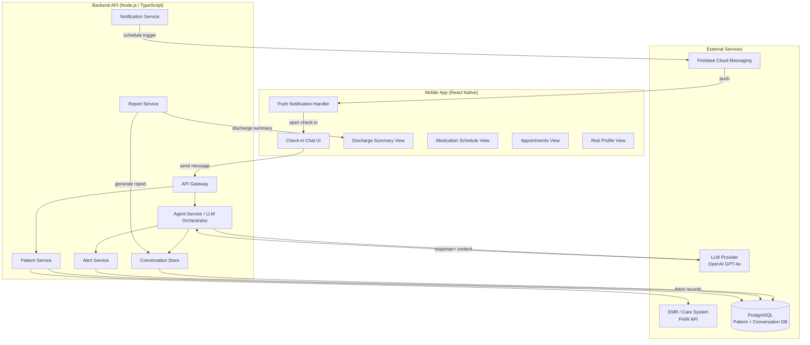
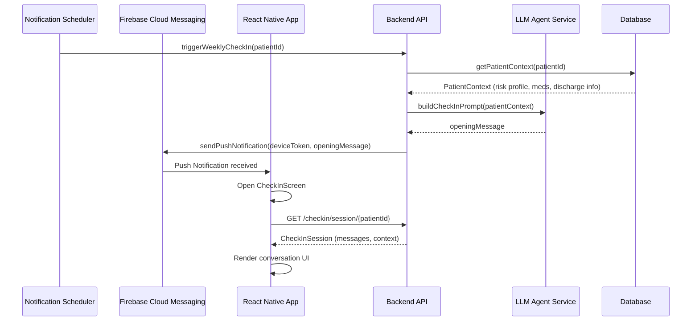
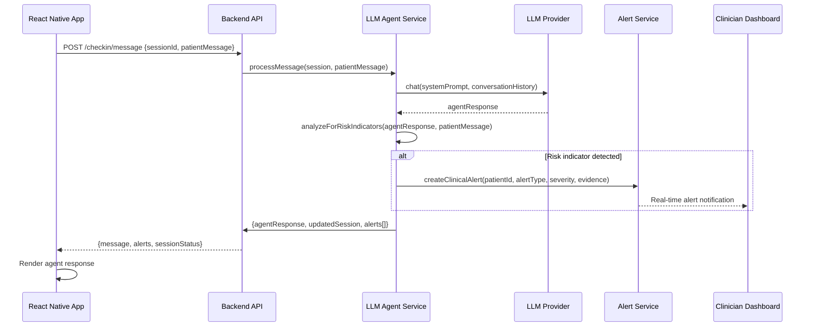

# Design Document: Post-Discharge Support Agent

## Overview

The Post-Discharge Support Agent is an AI-powered mobile application that proactively monitors elderly patients after hospital discharge through structured, conversational check-ins delivered via push notifications. The system combines a React Native mobile frontend, an LLM-based conversational agent, and a clinical backend to collect wellbeing data, surface discharge summaries, medication schedules, follow-up appointments, and automatically generate clinical alerts when responses indicate patient risk.

The application targets elderly patients as its primary cohort (with future support for non-English speaking individuals). Clinicians receive real-time alerts and aggregated conversation reports through a companion dashboard, enabling timely intervention without requiring patients to navigate complex healthcare portals.

The architecture follows a mobile-first, API-driven design: the React Native app communicates with a Node.js/TypeScript backend that orchestrates the LLM agent, persists conversation data, manages push notification delivery, and exposes a clinical alert stream to downstream EMR or care-coordination systems.


## Architecture




## Sequence Diagrams

### Check-in Initiation Flow



### Conversation + Alert Generation Flow




## Components and Interfaces

### Component 1: LLM Agent Service

**Purpose**: Orchestrates the check-in conversation by managing prompts, conversation state, and risk analysis. Acts as the intelligence layer between raw LLM responses and structured clinical data.

**Interface**:
```typescript
interface AgentService {
  startSession(patientId: string): Promise<CheckInSession>
  processMessage(sessionId: string, patientMessage: string): Promise<AgentTurn>
  finalizeSession(sessionId: string): Promise<DischargeSummaryReport>
  analyzeRisk(turn: AgentTurn, session: CheckInSession): RiskIndicator[]
}
```

**Responsibilities**:
- Build system prompts incorporating patient context (age, condition, risk level, discharge notes)
- Maintain conversation history and pass full context to LLM on each turn
- Extract structured data from free-form patient responses (pain level, medication adherence, mobility)
- Detect risk indicators from conversation semantics and trigger alert creation
- Finalize conversation into a discharge summary report

### Component 2: Notification Service

**Purpose**: Schedules and dispatches push notifications to patients on a weekly cadence post-discharge.

**Interface**:
```typescript
interface NotificationService {
  scheduleWeeklyCheckIn(patientId: string, dischargeDate: Date): Promise<void>
  sendCheckInPush(patientId: string, message: string): Promise<PushReceipt>
  sendMedicationReminder(patientId: string, medication: Medication): Promise<PushReceipt>
  sendAppointmentReminder(patientId: string, appointment: Appointment): Promise<PushReceipt>
  cancelSchedule(patientId: string): Promise<void>
}
```

**Responsibilities**:
- Manage device token registration and renewal
- Persist notification schedules in the database
- Handle FCM delivery receipts and retry on transient failures
- Respect patient notification preferences and quiet hours

### Component 3: Patient Service

**Purpose**: Central data access layer for all patient-related information, abstracting EMR/FHIR integration behind a clean internal API.

**Interface**:
```typescript
interface PatientService {
  getPatient(patientId: string): Promise<Patient>
  getRiskProfile(patientId: string): Promise<RiskProfile>
  getMedications(patientId: string): Promise<Medication[]>
  getAppointments(patientId: string): Promise<Appointment[]>
  getDischargeNotes(patientId: string): Promise<DischargeNotes>
  updateDeviceToken(patientId: string, token: string): Promise<void>
}
```

**Responsibilities**:
- Fetch and cache patient records from FHIR-compliant EMR
- Normalize EMR data into internal domain types
- Persist device tokens for push delivery
- Provide patient context to the Agent Service for prompt construction

### Component 4: Alert Service

**Purpose**: Creates, persists, and dispatches clinical alerts to care teams when the agent detects concerning patient responses.

**Interface**:
```typescript
interface AlertService {
  createAlert(alert: CreateAlertInput): Promise<ClinicalAlert>
  getAlertsForPatient(patientId: string): Promise<ClinicalAlert[]>
  acknowledgeAlert(alertId: string, clinicianId: string): Promise<void>
  getUnacknowledgedAlerts(): Promise<ClinicalAlert[]>
}
```

**Responsibilities**:
- Evaluate risk indicator severity and map to alert categories
- Persist alerts with full conversation evidence
- Notify on-call clinicians via push or webhook
- Support alert acknowledgment workflow

### Component 5: React Native App (CheckIn Module)

**Purpose**: Delivers the patient-facing check-in experience as a conversational chat UI, triggered by push notifications.

**Interface**:
```typescript
interface CheckInScreenProps {
  sessionId: string
  patientId: string
  onSessionComplete: (report: DischargeSummaryReport) => void
}

interface DischargeViewProps {
  patientId: string
}

interface MedicationViewProps {
  patientId: string
  onReminderToggle: (medicationId: string, enabled: boolean) => void
}
```

**Responsibilities**:
- Handle push notification deep-link to open correct session
- Render chat-bubble conversation UI optimized for elderly users (large text, high contrast)
- Display discharge summary, medication schedule, and appointment cards
- Show patient risk profile badge
- Support future i18n/localization layer for non-English speakers

